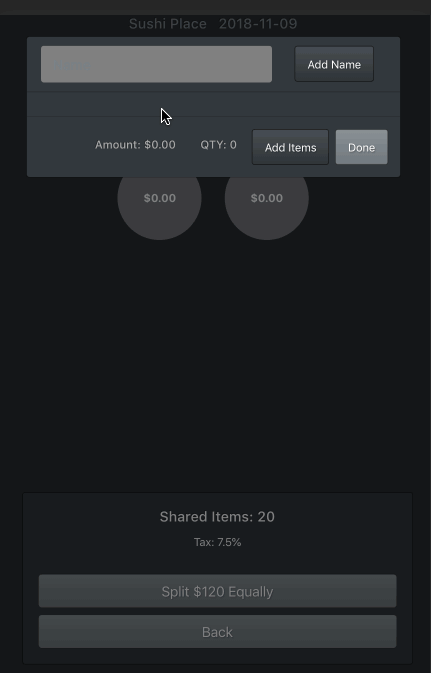
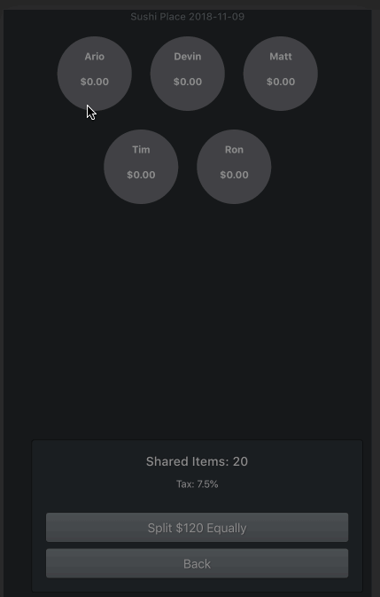
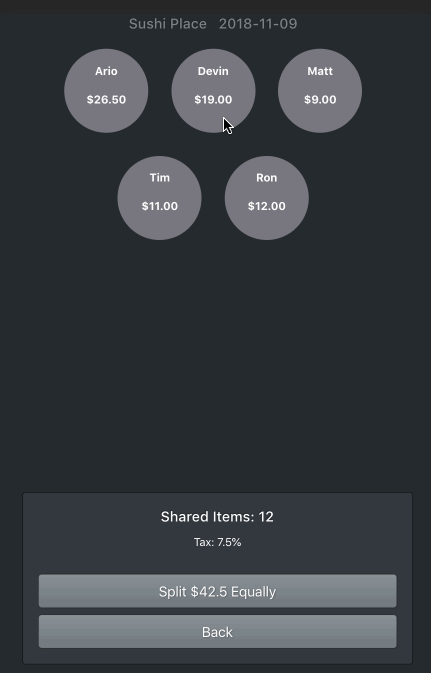
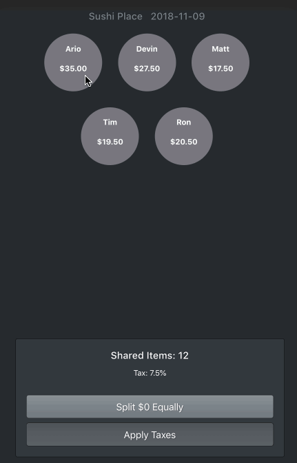

# SplitIt!

 An application for groups to easily split their restaurant bill on their mobile devices.
 

#### Add the bill's subtotal, tax and table's basic information to build your virtual table.
<p align="center">

</p>


#### Add a name to each seat.
<p align="center">

</p>


#### Assign each bill item to the fellow seat. The amount reduces when you assign items to seats.
<p align="center">

</p>


#### Remaining balance belongs to shared items. Split this amount equally between seats.
<p align="center">

</p>


#### Add taxes based on each seat's order amount.
<p align="center">

</p>


## Technologies
- React.js
- HTML5
- CSS3
- JavaScript


## Usage
Clone and install dependencies.
```
git clone https://github.com/ariozone/split-it.git
cd split-it/
npm install
```
Run the app
```
npm run dev
```
