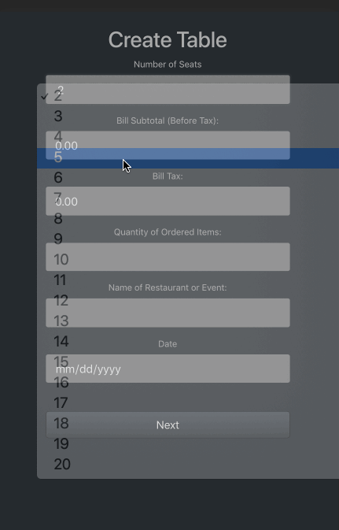

# SplitIt!
An application for groups to easily split their restaurant bill.

### Add the bill's subtotal, tax and table's basic information to build your virtual table.



## Technologies
- React.js
- HTML5
- CSS3
- JavaScript


## Usage
Clone and install dependencies.
```
git clone https://github.com/ariozone/split-it.git
cd split-it/
npm install
```
Run the app
```
npm run dev
```
